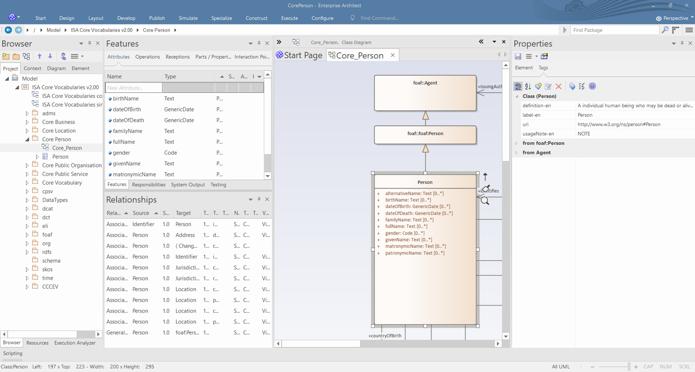

#### [<<< Previous page: Artefact generation](./artefact_generation.md) --- [Next page: Editorial flow >>>](./editorial_flow.md)

# Modeling data specifications

This chapter describes the key notions and information an editor needs to understand for _editing data specifications_.
Within this document the term data specification is used to refer to its core: **the semantic model**, i.e. the classes and properties with their semantic description.
Besides this, and beyond the scope of this chapter, a data specification contains metadata about the document, a changelog, use case descriptions, context, conformance statements and more.


First, an overview of the different **data specification categories** is presented. 
Understanding this categorisation helps the editors in their semantic model editing activity, as it provides an insight into the relationship between the generated artefacts and the expectations of consumers.
The second part of this chapter discusses the **master data management** of the data specification.
It describes the approach how editors must construct the UML models (which is the chosen master data representation), to be processed by the toolchain.


The second part of this chapter discusses the **master data management** of the data specification. It describes the approach how editors must construct the UML models (which is the chosen master data representation), to be processed by the toolchain.

Relevant links to items described in the following sections are numbered throughout the page, and are included in the **'Links' section** at the bottom.

For details on implementation aspects of the modeling, that are not discussed in this chapter, please consult the following chapters:
- [Artefact generation process](./artefact_generation.md) - for insights on, and pointers to, the software used
- [Toolchain](./toolchain.md) - for understanding the automation process set up for publishing data specifications exploiting GitHub.


## Table of Contents
1. [Data specification categories](#1-data-specification-categories)
2. [Intro to the UML model](#2-intro-to-the-uml-model)
3. [Master data management](#3-master-data-management)
4. [Transformational argument](#4-transformational-argument)
5. [Editorial argument](#5-editorial-argument)
6. [The semantic model in UML](#6-the-semantic-model)
7. [UML annotations (tags)](#7-uml-annotations)
8. [Example annotated UML model](#8-example-annotated-uml-model)
9. [Test suite](#9-test-suite)
10. [Links](#10-links)

## 1. Data specification categories

Designing a data specification encompasses the following activities:
- determining the appropriate data structures that should be used (classes, properties, etc.)
- for each entity, specifing the necessary semantic information to relate it to the real world phenonomen it describes.

Data specifications can roughly be categorized in three categories according to their intent of reuse.

A *vocabulary* is a collection of terms. 
A term consists minimally of a label and definition, and it is identified by a URI. 

The information attached to a term in a vocabulary is expressed with the intent to be applicable within a broad context. Specific **Guidelines on good definitions writing** exist, and are available for consultation. [1]


 
An *application profile* is the usage of terms within a generic application context. 
The application context imposes additional constraints on the usage of the terms such as cardinality restrictions, ranges, code lists, etc.
This usage context may also introduce alternative labels, or more specific definitions for reused vocabulary terms. 
Editors of application profiles have the challenge to find the balance between introducing new terms and reusing existing terms. 

Application profiles can be further elaborated to the point where they describe the usage of the terms in an operational environment (e.g. a software solution). 
These are called *implementation models*.


Aside from the differences in the content resulting from the reuse perspective, each category has different expectations on the to be published artefacts. 
These expectations, summarized below, result from the premise to use the _Semantic Web_ as the __basis__ for the design of the data specification.

_Vocabularies_ expect: 

  - a document with a simple tabular view of the terms 
  - dereferenceable persistent identifiers 

_Application profiles_ expect:

  - a document 
    - explaining the application scope 
    - providing a visual overview of the data model
    - a textual or tabular representation describing the data model entities
  - supportive assets for implementers, such as
    - SHACL templates
    - JSON-LD context files
    - XSD schemas
    - examples
  - to being integrated with the vocabularies they reuse

_Implementation models_ expect:

  - the same as application profiles, but usually augmented with additional artefacts specific for a given system,
      e.g., a template DB or an API specification.


The design of a data specification usually involves the creation of other data specifications of another category.
It is seldom that a data specification will rely only on already existing data specifications.
In particular, the development of application profiles and implementation models is naturally combined with the creation of a vocabulary.
That vocabulary captures all new terminology that has not yet been published.


The **SEMIC Core Vocabularies** have the design intent of the _vocabularies_ category; namely, broad reuse, mostly ignorant of the application context.
Over the years, however, the SEMIC community has requested support towards the *application* of the Core Vocabularies. 
Therefore, some expectations that are enumerated above for *application profile* artefacts, are also provided for the Core Vocabularies. 
Given the broad reuse objective, the provided artefacts are very permissive and thus should be seen as the initial step in the process of incorporating the Core Vocabularies in an application context. 
For instance, the SHACL shape for a Core Vocabulary is very permissive as it soley expresses that the range of a property might be of an expected broad type (e.g. Literal versus Resource). 
It does not include any cardinality restriction, because Core Vocabularies do not express cardinality limitations.

The Core Vocabularies are showing that the boundaries between a vocabulary and an application profile, as defined above, are not precisely determined.
Vocabularies, application profiles and implementation models are entities along a "reusability/application context" axis.
Vocabularies are collections of terms formulated in such a way that they are reusable to a maximum extent without becoming semantically too vague or abstract.
Application profiles are other collections of the same terms, but within a more specific, however still generic, application context. 
On the other extreme are the implementation models, providing a collection of terms used within a very specific context.

At this moment, however, _no formal expectation of the SEMIC data specifications_ has been written out. We are clarifying these concepts here in the assumption and hope that the editors' awareness of this categorisation will aid the creation the most appropriate semantic models.


## 2. Intro to the UML model


As mentioned in the previous section, a SEMIC data specification is build and published according to the best practices of the Semantic Web.
Following this approach data specifications identify terms with URIs and associate the term with the real world using associated semantic information expressed as human readible expressions (labels, definitions, usage notes, ...) and formal logic statements (subclass axioms, domain, range, cardinality restrictions, etc.). 

However, because the Semantic Web representations (rendered as HTML tables or in machine readable formats, such as RDF) are not providing consumers a satisfactory way for understanding the data specification, often a graphical representation is provided.
Graphical representations are able to convey more concisely the key formal logic statements at one glance.
Instead of reinventing a new graphical language, SEMIC uses the Unified Modeling Language (UML) as graphical modelling language.


###  3. Master data management


Working with two (or more) distinct modelling languages simultanously creates a significant challenge. 
It would be a waste of time and effort, if the editors would have to express the same data specification in two distinct modelling languages.
Therefore, one modeling language should be selected as the "master", from which the other representations would be derived.

Within the SEMIC toolchain, the "master" for the semantic model is the UML representation. 
This decision is motivated based on two compelling arguments: the "transformational argument" and the "editorial argument".


#### - 4. Transformational argument

Turning RDF vocabularies into UML, to fully exploit the graphical notation possibilies, would require to create a new configuration language.
This language would not only include semantical instructions (such as "this URI is a UML class"), but likely would also need to include styling and other represenation instructions. 
A large part of the editorial effort for a graphical representation is organising and styling the picture to make it as suggestive and meaningful as possible for the consumers. 
That is a complex task.
It is far more easier to exploit the power of a UML modeling tool, offering all the graphical styling possibilities an editor needs, and transform the resulting UML representation into a semantic model (such as RDF).


#### - 5. Editorial argument 

The interactions and discussions within a Working Group are often driven by a graphical representation.
Therefore, naturally, editors first create the graphical representation of the proposed resolution.
When agreement is reached, the decision is turned by the editor into the data specification following the Semantic Web principles.

Both arguments resulted in the design decision to store the master data of the data specification in a UML model.
However, despite the fact that the UML diagram will act as the master data for the data specification, it is the **semantic model** that is generated from it that the consumers will consider as the data specification.


### 6. The semantic model in UML

Having the UML model as master data means that the UML must be constructed to contain **all** information required for the Semantic Web representation. 
The UML Conversion Tool that is part of the toolchain is capable of interpreting not only the standard semantics of the UML language, as it is expected, but also of the additional annotations that are defined on the UML model elements.
These annotations are key because they control :
  - the URI assignments, and 
  - the human readible semantics.

This information is not part of the _standard_ UML language, and thus must be included in the UML model using a UML language extension mechanism, in order to fullfil the master data design. 

The approach for adding these annotations is elaborated in the following sections.
After the editors familiarize themselves with these sections, they should be able to read the UML of the data specifications in the SEMIC space.
The description of the impact and usage of each of the possible annotations is beyond the scope of this documentation.


#### 7. UML annotations (tags)

Without going into the details, the figure below shows the abstract metamodel of the information that the UML Conversion Tool extracts from the UML model augmented with annotations. 
For instance, the metamodel shows that there are _properties_ extracted, and that they may have a label associated. 


Most attributes in the above figure correspond to an annotation. 
They are implemented as **tags**. 
Tags can be applied to any UML model entity.

The **tag names** used in the SEMIC data specifications will follow the pattern:

```
   {data_spec_category}-{annotation}-{language}
```

The `{data_spec_category}` part represents the data specification category. The values for `{data_spec_category}-` can be at the moment either:
   - _ommitted_ :  the annotation is associated with the _vocabulary_ in which the term is defined. It contains the base information about the term.
   - `ap-` : the annotation is associated with an _application profile_ in which the term is used.


The `{language}` part corresponds to the **2-letter ISO 639-1 language code** [2] in which the content of the annotation is expressed.


**Examples:**
  - `label-nl`: the tag expresses the label of the term in Dutch, at the level of a vocabulary
  - `ap-usageNote-en`: the tag expresses the "usage note" annotation in English, for the application profile

Not all annotations require a prefix (`{data_spec_category}-`) or suffix (`-{language}`). 
For instance, the tag name `uri` has no prefix or suffix, as a term should have only one globally unique persistent identifier. 

Possible values for `{annotation}` are label, definition, usageNote, uri, name, parentURI, range, baseURI, codelist.   


The pattern is very useful because it allows to have two perspectives on the same term in the UML file.
One perspective is the base reference, i.e. the vocabulary, and the other perspective is the application usage context.
Having the ability to have them side by side makes it much easier for editors to ensure that the reuse of a term is done properly.
Artefact generation tools can take benefit from this multi-perspective to implement a sensible fallback approach. 
For instance, when generating application profile content, first the tags with `{data_spec_category}` having value `ap` are consulted. 
If no value is found, then the vocabulary tag is consulted. 
Only when this is not present a `TODO/NOT FOUND` value is used.
Application profile editors are thus supported when reusing existing vocabularies.


#### 8. Example annotated UML model

The following screenshot shows the class _Person_ defined in the Core Person Vocabulary, when edited in Enterprise Architect. 



In the middle of the screenshot we can see the graphical representation of the (partial) UML diagram where the class _Person_ is selected. 
On the right hand side the tags for the selected _Person_ class are shown.
On the left side of the graphical representation the attributes and relationships of the selected class can be seen.


#### 9. Test suite

A test suite is a collection of examples that editors can use to understand the impact of a modeling choice in combination with the annotations for each supported data specification category. 


An example of test suite is **OSLOthema-toolchain Testbed** [3], which is a _thema_ repository that provides a collection of examples of UML models and that can be used by editors to do regression testing during development.


#  10. Links

[1] [Guidelines on good definitions writing](https://github.com/SEMICeu/OpenGuidelines/blob/main/Principles%20for%20creating%20good%20definitions_v1.00.pdf)

[2] [Full list of ISO 639-1 language codes](https://en.wikipedia.org/wiki/List_of_ISO_639-1_codes)

[3] [OSLOthema-toolchain Testbed](https://github.com/Informatievlaanderen/OSLOthema-toolchainTestbed)

#### [<<< Previous page: Artefact generation](./artefact_generation.md) --- [Next page: Editorial flow >>>](./editorial_flow.md)
