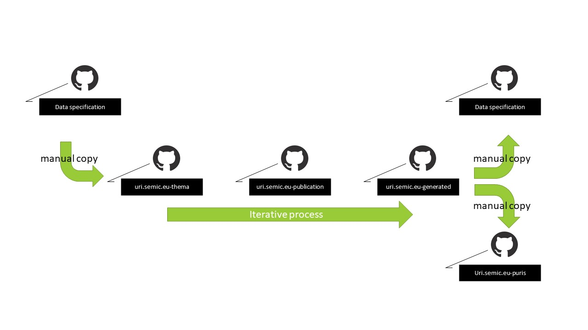

#### [<<< Previous page: Datamodel](./datamodel.md) --- [Next page: Toolchain >>>](./toolchain.md)

# Editorial flow

An editorial flow is initiated when issues for a data specification are to be addressed.
This section provides a high level overview on how the editor will interact with the SEMIC GitHub space to execute this task.

First, we provide a generic description of the editorial flow, at design level. It is composed of three main parts, including a total of six steps.

Next, we provide an example of the generic editorial flow, to make the description more concrete. To make the examples even more easier to understand, for each of the three parts of the editorial flow we also prepared a short screen videorecording, which illustrate in a more dynamic and visual manner some of the steps involved.

Relevant links to items described in the following sections are numbered throughout the page, and are included in the **'Links' section** at the bottom.

# 1. Generic editorial flow

The editorial flow consist of 3 larger parts, with 6 steps in total:

## **Part 1: Change the UML model**

*Step 1. Find the latest UML master data*

   The editor selects the GitHub repository of the data specification, which contains the latest published artefacts, to determine the source information.
   From that repository the UML file is copied to the **thema repository** [1].

*Step 2. Edit the UML file in the thema repository* 

   The editor opens and edits the UML file in the appropriate UML editor. 
   The UML structure is modified to address the issue.
   These changes are made according to the **toolchain UML data model requirements** [2].

   The changed UML file is committed in the [thema repository](https://github.com/SEMICeu/uri.semic.eu-thema).
   
## **Part 2: Build the data specification artefacts using the toolchain**

*Step 3. Trigger the toolchain in the publication repository*

   The editor triggers the rendering of the data specification artefacts by adding a publication point in the **publication repository** [3].
   
   (For more information on how this is done, please check out the chapter on [How to trigger the generation of the artefacts](./toolchain.md#howto-trigger-the-generation-of-the-artefacts).)  

*Step 4. Check the generated artefacts*

   When the toolchain processing is finished, the artefacts become available in the **generated repository** [4].

   If the artefacts address the issue as expected, the editor can proceed with the publication. Otherwise, another iteration is required (back to Step 2).

## **Part 3: Publish the result**

*Step 5. Publish the generated artefacts*

   To provide the consumers access to the updated artefacts that were just generated, the editor must publish them to the appropriate locations, by copying the content to other GitHub repositories.

   
   This consists of copying artefacts to the data specification repository from where the editorial flow was started. 
   This must be done in accordance with the guidelines on these data specification repositories, for instance by creating a new release directory.

   (For more information on how this is done, please check out the GitHub documentation's section on [Managing releases in a repository](https://docs.github.com/en/repositories/releasing-projects-on-github/managing-releases-in-a-repository).)
   

   Another repository might be affected too; namely, when the editing resulted in an RDF content change for a persistent URI published by SEMIC.
   If this is the case, the change must be propagated also to the **PURI content repository** [5].
   

*Step 6. Verify the published artefacts*

   To finalise the editorial flow a final verification of the published data specification is advised.
   The editor will then take the role of the consumer to investigate if the new situation is as desired.

## NOTE: The Generation and publication of artefacts require manual effort

The workflow above shows that the artefact generation tooling (the toolchain) does not releases editors from substantial manual work.
This manual work happens at the start of the editorial flow and at the end.
In both cases the work introduces risks for unnoticed changes or incomplete publications.

To reduce these risks additional work has to be done to further integrate the artefact generation into the data specification repositories and vice versa.
This is feasible, but probably will require further alignment and restructuring of the data specification repositories in the SEMIC GitHub space.
Topics like version numbering, using shared PURI domain, etc. are affecting the automation.

# 2. Example editorial flow

To illustrate the generic editorial flow consider the common change request to add a property to a class in a data specification. 

The text below is summarised transcript of a video recording demonstrating the addition of a new property 'baptismal name' to the class Person in the Core Person Vocabulary. The example goes through the 3 main parts of the editorial flow, described above:

   - Part 1 demonstrates the editing of the UML model (Step 1 & 2)
   - Part 2 demonstrates the automated generation of the data specification artefacts, through the toolchain (Step 3 & 4)
   - Part 3 demonstrates the (manual) publication of the result (Step 5 & 6)

All demonstrated changes are performed on the involved repositories using a demonstration branch called `example`.
Using this branch all activities can be demonstrated on a working environment, except for the last step: the official publication of the transformation.

*Note*: The recording applies one way to interact with the repositories. 
This approach has been selected to facilitate the recording, not because is the most efficient or best way to interact with the SEMIC GitHub space.
Editors can use their preferred way to interact with the SEMIC GitHub space, e.g. checking out the code and working locally, then pushing the changes back.

* ***NOTE: The recording demonstrates <u>one way</u> to interact with the repositories*** - This approach has been selected to facilitate the recording, not because this is the most efficient or best way to interact with the SEMIC GitHub space. Editors can use their preferred way to interact with the SEMIC GitHub space, e.g. checking out the code and working locally, then pushing the changes back.

## Part 1: Editing of the UML model ([Part 1 video](https://github.com/SEMICeu/documentation/blob/main/images/part1.mp4?raw=true))

*Step 1. Find the latest UML master data*

The latest published UML file is located in the **Core Person Vocabulary repository** [6]

To start editing, copy this version of the file to the Thema repository [1] .

    In the [Core Person Vocabulary](https://github.com/SEMICeu/Core-Person-Vocabulary/tree/master/releases/2.00/uml) repository the latest published UML file is located.
    Copy this version to the [uri.semic.eu-thema](https://github.com/SEMICeu/uri.semic.eu-thema) for editing.
    

*Step 2. Edit the UML file in the thema repository*

   The editor edits the copy, and adds the property 'baptismalName' with the annotations: the label and definition in English, and the assigned URI.
   After finishing the editing, the editor commits the UML file to the thema repository.
   

   After finishing the editing, the editor commits the UML file to the Thema repository.
   
## Part 2: Generation of the data specification artefacts using the toolchain ([Part 2 video](https://github.com/SEMICeu/documentation/blob/main/images/part2.mp4?raw=true))

*Step 3. Trigger the toolchain in the publication repository* 

   The editor selects the commit hash corresponding to the UML file update in the Thema repository.
   
   Using this commit hash, the editor updates the **publication points** [7] in the publication repository. 
   
   In the demonstration video, the `branchtag` attribute of the publication points are updated with the new commit hash.
   This change will trigger the artefact generation process. The progress of the generation process can be followed in **CircleCI** [8].

*Step 4. Check the generated artefacts*

   When the artefact generation process is finished, the generated artefacts are available in the generated repository.
   In the demonstration video, the updated artefacts are found within the **directory [`/doc`]** [9]. 

   To prepare the next step, the editor checks the generated artefacts to see whether the result is correct (e.g. if the property is present in all relevant artefacts).
   There are two main ways in which the editor can check this: 
   - download the artefacts and check within the downloaded files for the new property
   - use the GitHub built in diffing support (For more information on how this is done, please check out the GitHub documentation's section on [Comparing commits](https://docs.github.com/en/pull-requests/committing-changes-to-your-project/viewing-and-comparing-commits/comparing-commits) or the instructions for the [Smart Diff action](https://github.com/marketplace/actions/smart-diff)).

## Part 3: Publication of the result ([Part 3 video](https://github.com/SEMICeu/documentation/blob/main/images/part3.mp4?raw=true))

*Step 5. Publish the generated artefacts* 

Since the `baptismal name` is a new property, and thus got a new PURI assigned, the editor has to publish the content in the PURI content repository [4]. 

   The editor extracts from the generated RDF artefact the triples that are relating to the new property, and stores these in a file with the name 'baptismalName'. 
   
   Using one of the many publicly available RDF serialisation tools, various RDF serialisations, such as N-Triples, Turtle, and RDF/XML, with the corresponding file extensions, are then created. In the video for this conversion an online web tool is used.
   
   The editor will commit these files in the directory `releases/m8g` in the PURI content repository *uri.semic.eu-puris*.
   For demonstration purposes the files created during the video are stored in the branch `example`.
   
   (An example Turtle file that was created for the `baptismal name` property is committed in the `releases/m8g` directory, and can be found [at this link](https://github.com/SEMICeu/uri.semic.eu-puris/blob/example/releases/m8g/baptismalName.ttl))
   
  
   * ***NOTE: Step 5 and 6 are only partially shown in the recording*** - In order to demonstrate all the steps, it would require to propagate the demonstration content to the consumers on an official channel. Therefore, only the changes that do not lead to immediate and direct impact on the consumers are included in the video.

   **Not in the recording:** To share the new artefacts with the public, the editor follows the publication guidelines for Core Person repository. 
   For that, the editor will use the version (release number) of the data specification.
   First, a directory named after the version is created in the Core Person Vocabulary repository, under the `releases` directory.
   Because the editor must ensure that no information contained in the previous release of the Core Person Vocabulary is lost in the new release, it is advised to initiated the content of the new directory with the content of the previous release.
   Then the artefacts from the generated repository in the directory `/doc/core-vocabulary/core-person/` are copied into this directory.
   Committing this will make the content available to the public.

 
*Step 6. Verify the published artefacts* 
    
   **Not in the recording:** By executing all the above steps will result in a page of the Core Person Vocabulary referring to the specific version of the artefact, which is reachable through a public URL of the following form: `https://semiceu.github.io/Core-Person-Vocabulary/releases/{version}/`. 
   
   This public URL provides the HTML representation of the Core Vocabulary.  By doing a final check on the content available at this URL, the editor will ensure the quality of work.
   

 (An example of the data specification page - including all artefacts and contextual information - can be found [at this link](https://semiceu.github.io/Core-Person-Vocabulary/releases/2.00/)).
  
   
  
 ## Links
 
[1] [Thema repository](https://github.com/SEMICeu/uri.semic.eu-thema)

[2] [toolchain UML data model requirements](./datamodel.md)

[3] [Publication repository](https://github.com/SEMICeu/uri.semic.eu-publication)

[4] [Generated repository](https://github.com/SEMICeu/uri.semic.eu-generated)

[5] [PURI content repository](https://github.com/SEMICeu/uri.semic.eu-puris) 

[6] [Core Person Vocabulary repository](https://github.com/SEMICeu/Core-Person-Vocabulary/tree/master/releases/2.00/uml)

[7] [Publication points](https://github.com/SEMICeu/uri.semic.eu-publication/blob/example/config/dev/publication.json)

[8] [CircleCI](http://circleci.com)

[9] [doc directory](https://github.com/SEMICeu/uri.semic.eu-generated/tree/example/doc)

#### [<<< Previous page: Datamodel](./datamodel.md) --- [Next page: Toolchain >>>](./toolchain.md)

