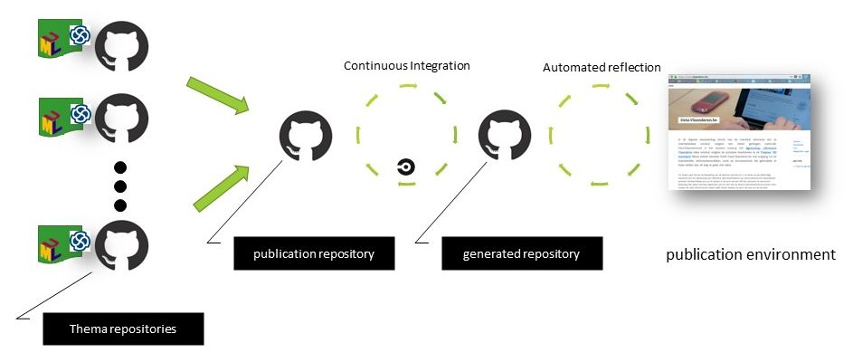

#### [<<< Previous page: Editorial flow](./editorial_flow.md) --- [Go back to: Homepage >>>](https://github.com/SEMICeu/documentation)

# Toolchain for publishing data specifications


## Motivation


The need for a toolchain emerged from the fact that data specifications have their own life cycle and the various Core Vocabularies are created by different (editorial) teams, with different Working Groups, at different times. In the past, this (manual) editing process resulted in producing similar, yet distinct, and sometimes incoherent, expressions of these Core Vocabularies. A situation that raised many questions by the consumers.

To have the data specifications progress in the same way, and following the same style, tooling support is required. 
Introducing tooling forces the editors to follow a predefined editorial flow, and thus reduce their editorial freedom to the limits of the tooling.
In practice, this limitation brings crucial benefits for the SEMIC project; namely:
  - provides a **harmonised, coherent experience of the data specifications**, which will increase the adoption by the consumers
  - allows **the embedding of the key SEMIC data modelling best practices in formal processes**, instead of relying solely on the experience of the editors.
  - supports the **scaling up of the editorial capacity**, through automation, which allows someone to learn the editorial flow in a safe environment.


This chapter describes the tooling that is supporting the editorial flow for managing data specifications. It focusses on the interplay between the different repositories, and how editors can use it to generate the data specification artefacts.

First, we present an overview of the overall design of the toolchain, and we describe how it is set up in the SEMIC space.

Then, we provide some useful information about the use of the toolchain, by answering a few frequently asked questions, coming from editors and developers.

Relevant links to items described in the following sections are numbered throughout the page, and are included in the **'Links' section** at the bottom.

The artefact generation itself is documented in a dedicated page on [artefact generation](./artefact_generation.md).


## Setup & Design

The toolchain used in the SEMICeu project is based on the **OSLO toolchain** [1]. 
The OSLO toolchain is part of a larger environment for supporting the generation, maintenance and publication of data specifications under the governance of the Flemish Government, Belgium.

Because OSLO has been involved in SEMIC from the start, the toolchain incorporates many advices and best practices SEMIC has produced or applies.
This is especially true for the support of the **editorial flow** [2]. 


The OSLO toolchain is part of a larger environment for supporting the generation, maintenance and publication of data specifications under the governance of the Flemish Government, Belgium.
Because OSLO has been participating in SEMIC from the start, the toolchain incorporates many advices and best practices SEMIC has produced or applies.
This is especially true for the support of the editorial flow. 
The main distinction between the use of the toolchain in the two environments is regarding their approach to publication. The current SEMIC practice is to use GitHub as publication platform, where each data specification is edited and published in its own repository. On the other hand, the OSLO toolchain has been designed with a single publication environment in mind.

In the [editorial flow](./editorial_flow.md) this distinction is indicated by the existence of the manual publication steps that the editor has to perform; steps that are not required in the OSLO context. It is future work to adapt the tooling to the SEMIC publication context.

The result produced by the OSLO toolchain can be seen at the portal of the **Flemish Government data portal** [3], while on Github **the source code of the tooling**, as well as of the data specifications are all publicly available [4].

(*For more information on the OSLO toolchain, contact the OSLO team. This can be done by posting a github issue, or via email (digitaal.vlaanderen@vlaanderen.be).
*)


### Generic Design

The high level design of the OSLO toolchain is illustrated in the figure below.



The objective is to automate the publication of the data specifications on a publication environment.
A _publication environment_ is a website identified by a domain. 
The content of that website can be (and usually is) broader than the data specifications, but the toolchain is solely concerned with the publication of the data specifications.
The toolchain is designed to create a static website, i.e. a collection of webpages.
This design choice simplifies the operational work to serve the data specifications on the publication environment, but more importantly it also provides the editors with an exact view on what is being shared with the consumers on the publication environment.

The source code of the static website, i.e. the publication environment, is stored on GitHub in the _publication repository_.
The result of the generation process, i.e. the static website, is stored in the _generated repository_. 
A _publication_ repository is thus always paired with a _generated_ repository. 


The generated repository is kept in sync with the publication repository via a **Continuous Integration/Continuous Development (CI/CD) execution flow** [5]. 

Within software engineering, CI/CD is the name for any automated process supporting the software building and deployment activities.
Each change (commit) to the publication repository will lead after a successful CI/CD execution to a change in the generated repository.

Using the branching functionality of Github repositories, system staging (i.e. publishing on development, testing and production publication environments) is also supported. 


To provide the editorial freedom and to let data specifications have their own life cycle, the source of each data specification is stored in their own repository. 
These repositories are called _thema repositories_. 
The publication repository contains a list of references to the thema repositories.
More precisely, they contain references to the state of the thema repositories at unique points in time, i.e. commits.
These references are called __publication points__.
Editors primarily interact with thema repositories, only when a new publication of the data specification is required, when they update the publication repository with a new publication point.
This setup creates flexibility and provides editorial scaling potential, without loosing a central control. 

The deployment of the above design is supported by the existence of two template repositories, both available on GitHub:
 - a **template for a publication repository** [6].
 - a **template for a thema repository** [7]

After creating the publication repository from the template, the publication repository must be paired with the generated repository.
On the contrary, the generated repository does not require a template. 

Information on how to do this, as well as more configuration options, is part of the **OSLO template documentation**, also available on GitHub [8].  


The generated repository does not require a template.


In contrast to the OSLO toolchain's premise of a single publication environment, (i.e. a single website), SEMIC has decided to apply a decentralised publication strategy. Each data specification repository in the SEMICeu space is not only the source of the specification, but also the publication platform for that data specification, by using **GitHub Pages** service. 


### SEMIC setup

In contrast to the OSLO toolchain premise of a single publication environment, i.e. a single website, SEMIC has decided to apply a decentralised publication strategy. 
Each data specification repository in the SEMICeu space is not only the source of the specification, but also the publication platform for that data specification, by using  [GitHub Pages](https://pages.github.com/) service offering. 

The OSLO toolchain separates the different functionalities (master data source, content generation, publication) in separate repositories, making it then natural to combine the processing of multiple data specifications into a pair of publication and generated repository. 
Since there is no unique SEMIC publication environment identified with a unique domain, there are two alternatives to use the toolchain. (a) Integrate in each SEMIC data specification repository the toolchain functionalities. 
Or (b) deploy the toolchain in new SEMICeu repositories, pretending there is a single SEMIC publication environment. 
The second option has been chosen as it impacted the existing data specification repositories the least, and it deviates the least from the OSLO toolchain setup.
The deployment corresponds to a minimal setup, providing already the most important editorial support for creating harmonised artefacts for all data specifications.

In the SEMICeu GitHub space the toolchain has been deployed in these repositories:


- **SEMIC publication repository** [9]
- **SEMIC generated repository** [10]
- **SEMIC thema repository** [11], that currently contains _all_ the SEMIC data specifications. This choice can be revisited in the future.


All editing happens on the `master` branch as there are no staging publication environments.

Within the SEMICeu GitHub space, these repositories are **private** GitHub repositories. 
This influences the execution and configuration, as operating on private repositories requires different GitHub API requests than those that can be used with public GitHub repositories.

This setup does not provide the end-to-end experience of the original design, but it is feasible that the CI/CD flow can be adapted to achieve this.

- For more information on this, and other aspects related to the configuration, please see the **documentation on the publication environment**[12] available on GitHub.

- For more information on how these repositories are used in the management of data specifications please check the [editorial flow](./editorial_flow.md) page within this repository.


#### Thema repository(ies)

The deployment of the toolchain resulted in a simplified setup with a _single_ thema repository. This choice has been made to facilitate the ongoing harmonisation of the Core Vocabularies and to ensure that future contractors will have everything at their disposal to perform changes.

One can consider the current SEMIC thema repository as the shared space to have the toolchain functioning. However, this choice might need to be reconsidered in the future, in order to provide even more support to editors. 

The toolchain is designed to work with **multiple thema repositories**.To organise the SEMIC data specifications in multiple thema repositories the following considerations can best taken into account:

  - It is best to group all data specifications that are defining PURIs in the same namespace in one thema repository. 
    Like this the risk for creating overlapping concepts is reduced, and the impact of a change on a URI is more visible.
    
  - It is best to decide a branching and tagging strategy within the thema repository. E.g. each data specification could be hosted on a separate branch.

Note that the some options might be blocked by past decisions. For instance, the PURI design influences strongly the grouping. 
I.e. the PURIs in the domain _`http://data.europa.eu/m8g`_ form a global space and therefore all data specifications that create PURIs in this domain are best maintained together.
Modularity in the PURI design will thus also facilitate modularity in the data specification management.

Currently, none of the above considerations have been discussed in depth, besides the "quick win" motivation.
They will be part of future work, to bring further improvments to the editorial flow, and must be done in collaboration with the whole SEMIC team.


#### (Software) Components

This section lists the main software components involved in the toolchain which the editors and developers should be aware of. 

They are:

- UML editing tool: [Enterprise Architect from Sparx systems](https://www.sparxsystems.eu/enterprise-architect)
- Source Control System: [GitHub](https://github.com)
- Continuous Integration/Continuous Deployment: [CircleCI](https://circle.com)
- OSLO toolchain tools:
    - UML content extraction tool: [EA-to-RDF](https://github.com/Informatievlaanderen/OSLO-EA-to-RDF/tree/multilingual)
    - artefact generators: [OSLO Specification Generator](https://github.com/Informatievlaanderen/OSLO-SpecificationGenerator/tree/multigual-dev)
    - template for a publication repository: [OSLO-publicationenvironment-template](https://github.com/Informatievlaanderen/OSLO-publicationenvironment-template)
    - template for a thema repository: [OSLOthema-template](https://github.com/Informatievlaanderen/OSLOthema-template)

Commercial fees are only required for Enterprise Architect.
The others have a free tier version (to which the objectives of this work complies) or are Open Source components.

Users should have an GitHub account. That GitHub account grants access also to CircleCI.


## Editors HowTo

### HowTo trigger the generation of the artefacts

Triggering the generation of the artefacts is done via changing the _publication_ repository. 
When a change is committed to the _publication_ repository, a CI/CD process is initiated which produces the artefacts.
The result of the generation process is stored in the _generated_ repository.

A commit to the _thema_ repository is **not** triggering the generation process. 
An editor can thus improve incrementally the content in the _thema_ repository, without being forced to generate each time the artefacts.
The editor will trigger the generation process only when needed.

The usual change to the publication repository for triggering the generation process consists of **changing the publication point** corresponding to the data specification that has been edited.
A publication point is a reference to a data specification in a _thema_ repository.
An example is shown below:
```
{
    "urlref": "/doc/core-vocabulary/core-person",
    "repository": "git@uri.semic.eu-thema:SEMICeu/uri.semic.eu-thema.git",
    "branchtag": "4629f50dbb5953284f83bda9321305bfeb2f7da7",
    "name": "core-person-ap",
    "filename": "config/core-person.json",
    "navigation": {}
  },
```
An elaborated description of the structure and semantics of the attributes is found in the SEMIC publication repository [9].

Intuitively, the above publication point can be read as the following processing instruction: "Write in the generated repository, at path `{urlref}`, the generated artefacts for the data specification `{name}`, according to config file `{filename}` located in `{repository}` as of the commit `{branchtag}`."

Thus, since changing the data specification content is changing the thema repository, a change in the publication point can correspond to changing the `{branchtag}` to point to the new content. Performing this change will trigger the generation of the artefacts.

Besides technical expectations (such as the repository should be a GitHub repository), the toolchain does not impose editorial management rules on a publication point's structure. For instance, SEMIC could impose rules for the name-giving of the filenames, urlref path structure, and branchtags, but SEMIC could also impose a correspondence between the branchtag and the urlpath structure.
This is future work, and should be considered in the context of further integrating the toolchain in the publication process.


## Developers HowTo

### HowTo find the source code of the automation

The **source code for the CircleCI automation** [13] can be found in the SEMIC  _publication_ repository. 

The organisation and setup of the **CircleCI workflow**, is instead extensively documented in OSLO _template_ repository [14].
The CircleCI workflow will execute in some of its steps software that are available as public Docker images. 
These images are build from the following open source repositories:
  - [OSLO-EA-to-RDF](https://github.com/Informatievlaanderen/OSLO-EA-to-RDF)
  - [OSLO-Specificationgenerator](https://github.com/Informatievlaanderen/OSLO-SpecificationGenerator)


# Links

[1] [OSLO toolchain](https://github.com/Informatievlaanderen/OSLO-toolchain/tree/master/doc-generic)

[2] [Editorial flow](./editorial_flow.md)

[3] [Flemish Government data portal](https://data.vlaanderen.be)

[4] [OSLO source code | GitHub](https://github.com/search?q=org%3AInformatievlaanderen+topic%3Aoslo)

[5] [Continuous Integration/Continuous Development (CI/CD) execution flow](https://en.wikipedia.org/wiki/CI/CD)

[6] [OSLO Template for a publication repository](https://github.com/Informatievlaanderen/OSLO-publicationenvironment-template).

[7] [OSLO Template for a thema repository](https://github.com/Informatievlaanderen/OSLOthema-template)

[8] [OSLO template documentation | GitHub](https://github.com/Informatievlaanderen/OSLO-publicationenvironment-template/tree/main/config)

[9] [SEMIC publication repository](https://github.com/SEMICeu/uri.semic.eu-publication)

[10] [SEMIC generated repository](https://github.com/SEMICeu/uri.semic.eu-generated)

[11] [SEMIC thema repository](https://github.com/SEMICeu/uri.semic.eu-thema) 

[12] [SEMIC publication environment documentation](https://github.com/SEMICeu/uri.semic.eu-publication/blob/master/config/README.md)

[13] [CircleCI automation source code](https://github.com/SEMICeu/uri.semic.eu-publication/tree/master/.circleci)

[14] [CircleCI workflow](https://github.com/Informatievlaanderen/OSLO-publicationenvironment-template/tree/main/.circleci)

#### [<<< Previous page: Editorial flow](./editorial_flow.md) --- [Go back to: Homepage >>>](https://github.com/SEMICeu/documentation)
n
